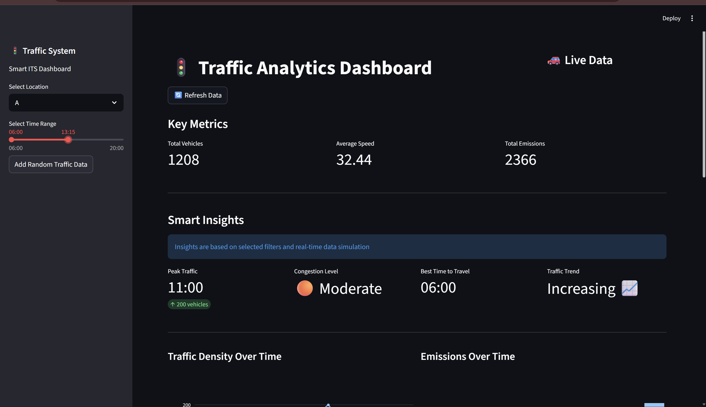

# 🚦 Traffic Analytics System

An interactive traffic analytics dashboard built using Streamlit and MongoDB to simulate intelligent transportation system (ITS) monitoring.

## 📌 Overview

This project analyzes traffic patterns including vehicle density, speed, and emissions. It provides real-time simulation, filtering, and intelligent insights such as congestion levels and peak traffic detection.

## ✨ Features

- 📊 Interactive dashboard with charts and KPIs
- 🗂 MongoDB database integration
- ⏱ Time-based filtering using slider
- 🚦 Congestion detection (Low / Moderate / High)
- 📈 Traffic trend analysis
- 🔁 Real-time data simulation (add random traffic data)
- 📥 Download filtered data as CSV
- 📑 Organized UI with tabs (Dashboard, Insights, Data)

## 🛠 Tech Stack

- Python
- Streamlit
- MongoDB (Atlas)
- Pandas
- Plotly

## 📷 Screenshot



## ⚙️ Setup Instructions

1. Clone the repository:
```bash
git clone https://github.com/HarshitJhajharia/traffic-dashboard.git
cd traffic-dashboard